I build AI systems that hold up in production, along with the infrastructure that keeps them running. My work spans the whole path from model to user: agents and real-time voice AI, LLM training and inference, Kubernetes platforms, and the observability that ties it all together.

Right now I'm building an LLM stack from scratch, from pretraining in PyTorch to inference in Rust and serving in Go. Those repos are pinned below.

## Production highlights

- **Agentic automation at scale.** Architected a browser-agent platform (Gemini on Vertex AI, browser-use, Patchright) that runs high-volume operational workflows like traffic-challan settlement and border-tax filing end to end: **10,000+ tasks a day**, **500K+ completed**.
- **Unit economics.** Took per-task handling from ~10 minutes to **under 2.5 minutes** at **~₹0.05 per task**, the daily throughput of ~100 human agents at **under 1% of the cost**.
- **Support automation.** Paired the agent pipeline with fine-tuned reply-drafting models, cutting ticket resolution from **1–2 days to 10–15 minutes**.
- **Real-time voice AI.** Built a Hindi/Hinglish voice assistant on LiveKit and Gemini that handles live calls, with self-hosted STT/TTS to cut latency and per-call cost versus managed speech APIs.
- **Platform ownership.** Built the AI and automation stack from zero for a platform serving **100K+ drivers**, and run it as the sole DevOps and MLOps engineer. Migrated production to a custom-autoscaled edge-plus-worker architecture on GCP, now on GKE, and own deployment, autoscaling, reliability, and observability end to end.

## Expertise

<table>
<tr>
<td width="50%" valign="top">

**AI / ML engineering**

- LLM pretraining in PyTorch: DDP, bf16, `torch.compile`
- Fine-tuning and alignment: SFT, DPO
- Tokenizers, data curation, and evals
- Agentic systems and real-time voice AI

</td>
<td width="50%" valign="top">

**Systems engineering**

- LLM inference internals: GQA, RoPE, KV caching
- Paged KV cache and continuous batching
- Q8/Q4 quantization with AVX SIMD kernels in Rust
- Benchmarking and logit-level verification

</td>
</tr>
<tr>
<td width="50%" valign="top">

**MLOps and infrastructure**

- GCP: GKE, Compute Engine, Vertex AI
- Kubernetes, Docker, Terraform, Linux, CI/CD
- Autoscaling on queue depth and TTFT SLOs, GPU scale-to-zero on spot
- Observability: OpenTelemetry, Prometheus, Grafana

</td>
<td width="50%" valign="top">

**Software engineering**

- Rust, Go, Python, TypeScript
- Concurrent, high-throughput pipelines and worker fleets
- Servers and APIs: axum, gRPC, OpenAI-compatible endpoints
- Language internals: OTTL grammar to evaluation

</td>
</tr>
</table>

## Open source

Contributor to the [OpenTelemetry Collector](https://github.com/open-telemetry/opentelemetry-collector) (CNCF), across the core collector and [collector-contrib](https://github.com/open-telemetry/opentelemetry-collector-contrib):

- Built the `Coalesce()` OTTL converter end to end, from grammar to evaluation
- Changed the default error mode of the widely used transform processor
- Added a gRPC user-agent override to the collector's core configuration layer
- Also merged work across receivers (Kafka, Google Cloud Pub/Sub, host metrics), exporters (AWS S3, debug), and auth/encoding extensions

## Tech stack

<picture>
  <source media="(prefers-color-scheme: light)" srcset="https://skillicons.dev/icons?i=rust,go,py,ts,pytorch,gcp,kubernetes,docker,terraform,linux,githubactions,prometheus,grafana,git&perline=7&theme=light" />
  
</picture>

## GitHub stats

<picture>
  <source media="(prefers-color-scheme: dark)" srcset="https://raw.githubusercontent.com/57Ajay/57Ajay/HEAD/assets/stats-dark.svg" />
  
</picture>

---

Based in Gurugram, India, and open to remote roles or relocation. Email is the fastest way to reach me: [57ajay.u@gmail.com](mailto:57ajay.u@gmail.com)
